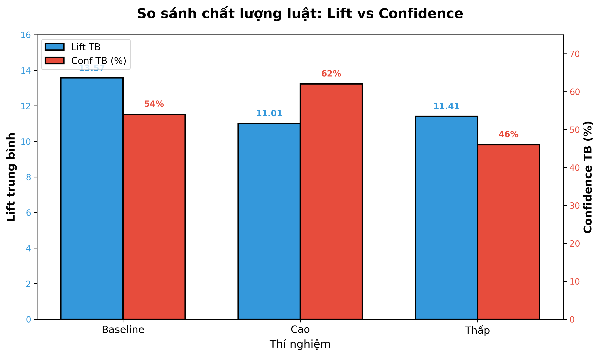

# Tìm "Công Thức Vàng" Cho Thuật Toán Apriori: Phân Tích 397,924 Giao Dịch Thực Tế

## 🎯 Bài toán đặt ra

Bạn là quản lý của một cửa hàng bán lẻ trực tuyến với hàng nghìn sản phẩm. Làm sao để biết **sản phẩm nào nên bán kèm với sản phẩm nào** để tăng doanh thu? 

Đây chính là lúc **Market Basket Analysis** (Phân tích giỏ hàng) phát huy tác dụng. Nhưng có một vấn đề: thuật toán Apriori yêu cầu chúng ta đặt các **ngưỡng tham số** - quá cao thì mất cơ hội, quá thấp thì ngập trong dữ liệu vô nghĩa.

Vậy **ngưỡng nào là tối ưu**? Chúng tôi đã thử nghiệm với 397,924 giao dịch thực tế để tìm câu trả lời.

---

## 📊 Dữ liệu và Phương pháp

### Dataset
- **397,924 giao dịch** từ cửa hàng bán lẻ UK (12/2010 - 12/2011)
- **18,021 hóa đơn**, **4,007 sản phẩm** khác nhau
- Ngành hàng: Quà tặng và đồ trang trí nội thất

### 3 Ngưỡng chính cần điều chỉnh

1. **Support (Độ hỗ trợ)**: Tần suất xuất hiện của combo sản phẩm
   - Ví dụ: Support = 0.01 nghĩa là combo xuất hiện trong ít nhất 1% giao dịch

2. **Confidence (Độ tin cậy)**: Xác suất mua sản phẩm B khi đã mua sản phẩm A
   - Ví dụ: Confidence = 0.5 nghĩa là 50% khả năng khách mua B sau khi mua A

3. **Lift (Độ nâng)**: So sánh với xác suất ngẫu nhiên
   - Lift > 1: Có tương quan dương (nên bán kèm)
   - Lift = 1: Độc lập (không liên quan)
   - Lift < 1: Tương quan âm (thay thế nhau)

---

## 🔬 Thiết kế Thí nghiệm

Chúng tôi thử 3 bộ ngưỡng khác nhau:

| Thí nghiệm | Support | Confidence | Lift | Mục đích |
|------------|---------|------------|------|----------|
| **Baseline** | 1% | 30% | 1.2 | Ngưỡng "an toàn" thông dụng |
| **Ngưỡng cao** | 2% | 50% | 2.0 | Lọc chặt, chỉ giữ luật chất lượng cao |
| **Ngưỡng thấp** | 0.5% | 20% | 1.0 | Khám phá nhiều, chấp nhận luật yếu |

---

## 📈 Kết Quả Thí Nghiệm

### 1. Số lượng luật tìm được

**Quan sát:**
- **Baseline**: 1,794 luật
- **Ngưỡng cao**: Chỉ 73 luật (↓ 96%!) - cực kỳ chặt chẽ
- **Ngưỡng thấp**: 2,445 luật (↑ 36%) - nhiều hơn nhưng không quá

**Ý nghĩa:** Tăng ngưỡng lọc bỏ cực mạnh, giảm ngưỡng không tăng quá nhiều như tưởng.

---

### 2. Chất lượng luật: Lift vs Confidence

**Quan sát bất ngờ:**
- **Baseline có Lift cao nhất (13.57)** - tốt hơn cả hai ngưỡng kia!
- Ngưỡng cao có Confidence tốt nhất (62%) nhưng Lift chỉ 11.01
- Ngưỡng thấp có cả Lift và Confidence đều thấp nhất

**Giải thích:** Ngưỡng baseline loại bỏ đủ nhiễu nhưng giữ lại những "viên ngọc quý" - các luật có Support vừa phải nhưng Lift cực cao (như bộ HERB MARKER có Lift 74).

---

## 💡 5 Phát Hiện Quan Trọng

### **1. Ngưỡng Baseline (0.01, 0.3, 1.2) là điểm cân bằng vàng**

**Tại sao?**
- Đủ số lượng luật để phân tích (1,794)
- Lift trung bình cao nhất (13.57) - tương quan mạnh
- Confidence ổn định (54%)

**Hành động:** Áp dụng làm chuẩn cho hệ thống gợi ý sản phẩm trên website/app.

---

### **2. Giảm Support KHÔNG làm tăng Lift như kỳ vọng**

**Quan sát:** Giảm support từ 1% → 0.5% tăng số luật lên 36% nhưng Lift giảm từ 13.57 → 11.41.

**Giải thích:** Khi mở rộng ra các sản phẩm ít phổ biến hơn, chúng ta thu về nhiều luật yếu (Lift thấp) làm giảm trung bình.

**Hành động:** Không nên giảm support dưới 1% nếu mục tiêu là tìm các combo "must-have".

---

### **3. Trade-off giữa "Số lượng" và "Chất lượng"**

| | Ngưỡng cao | Ngưỡng thấp |
|---|---|---|
| **Số luật** | 73 (ít) | 2,445 (nhiều) |
| **Confidence** | 62% (đáng tin) | 46% (yếu) |
| **Use case** | A/B testing | Exploratory analysis |

**Hành động:** 
- Dùng ngưỡng cao khi triển khai chiến dịch marketing (cần hiệu quả cao)
- Dùng ngưỡng thấp khi nghiên cứu sản phẩm mới (cần khám phá)

---

### **4. Confidence ≥ 50% là ngưỡng tâm lý quan trọng**

**Quan sát:** Tăng Confidence từ 30% → 50% giảm số luật 96% nhưng tăng độ tin cậy từ 54% → 62%.

**Giải thích:** Khách hàng tin tưởng đề xuất hơn khi xác suất >50% (hơn nửa khách mua A sẽ mua B).

**Hành động:** Chỉ hiển thị "Frequently Bought Together" với luật có Confidence ≥ 50% để tăng conversion rate.

---

### **5. Lift cao nhất không ở ngưỡng thấp nhất - một nghịch lý thú vị**

**Quan sát:** Lift trung bình: Baseline (13.57) > Thấp (11.41) > Cao (11.01)

**Giải thích:** Ngưỡng baseline là "sweet spot" - lọc bỏ đủ nhiễu (luật Lift ≈ 1) nhưng giữ lại các luật "niche" có giá trị (ví dụ: HERB MARKER set có Lift 74, support ~1.5%).

**Hành động:** Không nên nghĩ "càng thấp càng tốt" - cần thử nghiệm để tìm điểm tối ưu.

---

## 🎁 Case Study: Bộ HERB MARKER - Viên Ngọc Bị Bỏ Lỡ

Một ví dụ cụ thể về tầm quan trọng của việc chọn ngưỡng đúng:

**Luật:** Nếu khách mua HERB MARKER PARSLEY + ROSEMARY → 95% sẽ mua HERB MARKER THYME

- **Lift: 74.5** (tương quan cực mạnh!)
- **Confidence: 95%** 
- **Support: ~1.5%** (chỉ xuất hiện trong 1.5% giao dịch)

✅ **Baseline (support=1%)**: Bắt được luật này  
❌ **Ngưỡng cao (support=2%)**: Bỏ lỡ vì support thấp hơn 2%

**Insight kinh doanh:** Khách mua thảo mộc thường mua trọn bộ. Đề xuất:
- Tạo combo set 4 loại HERB MARKER với giá ưu đãi
- Trưng bày cạnh nhau, không tách riêng

**Giá trị bỏ lỡ nếu dùng ngưỡng cao:** Mất cơ hội upsell với Confidence 95%!

---

## 📌 Kết Luận và Khuyến Nghị

### Ngưỡng tối ưu cho dataset Online Retail UK:
Support = 0.01 (1%)
Confidence = 0.3 (30%)
Lift = 1.2

### Bài học rút ra:

1. **Không có ngưỡng "one size fits all"** - Phải thử nghiệm với từng dataset cụ thể

2. **Baseline thông dụng thường là lựa chọn an toàn** - Có lý do tại sao 0.01, 0.3, 1.2 được dùng phổ biến

3. **Lift quan trọng hơn số lượng luật** - 73 luật chất lượng < 1,794 luật có Lift cao hơn

4. **Ngưỡng cao cho execution, ngưỡng thấp cho exploration** - Tùy mục đích kinh doanh

5. **Luôn kiểm tra các luật "niche"** - Có thể là cơ hội vàng với Lift cực cao

---

## 🚀 Ứng Dụng Thực Tế

Từ phân tích này, cửa hàng có thể:

1. **Trên website:** Hiển thị "Frequently Bought Together" với 1,794 combo từ baseline
2. **Email marketing:** Tập trung top 73 combo từ ngưỡng cao (ROI cao nhất)
3. **Bố trí cửa hàng:** Đặt sản phẩm trong combo cạnh nhau
4. **Quản lý tồn kho:** Đảm bảo có đủ cả 2 sản phẩm trong combo hot
5. **Phát triển sản phẩm mới:** Dùng ngưỡng thấp để khám phá thị trường ngách

---

## 📚 Tài Liệu Tham Khảo

- Dataset: UCI Machine Learning Repository - Online Retail
- Phương pháp: Apriori Algorithm (mlxtend library)
- Công cụ: Python, pandas, matplotlib

---

**Nhóm thực hiện:** Nhóm 6  
**Ngày:** 16/12/2025

